##  Introduction

Our project goal is to be able to detect breathing and heartbeat patterns while a person meditates. The meditation style we're focusing on is shavasana meditation, where someone is lying down and focusing on their breath. 

*Our goal is to help people new to meditation understand heartbeat and breathing patterns they experience through their meditation sessions*. We plan to use our smartphone as the sensor, and we will collect data by finding an optimal placement on our chest to measure frequency of breathing and heartbeat.

  
Background

There are not many existing quantitative measures of meditation that are reliable. Electroencephalogram (EEG), the detection of electrical activity in the brain, and heart rate variability (HRV) are two existing methods, though they are both responses that take a long time to detect patterns from. Breath rate, however, is a measure that is controlled by meditation and can have changes detected over a short period of time.

  
Value Creation

We believe that we can help people new to meditation better understand their meditative patterns through showing them a summary of their heartbeat and breathing patterns after the session. Quantitative analysis of meditation!

___

##  Data Collection Method

We collected various one minute and five minute samples of someone lying down and meditating, alongside one minute and five minute control samples of the phone lying in the same orientation and location. The purpose of our control samples were so that we could subtract any noise present in our meditation samples.

  
Sensor Choice

We chose to use a Pixel phone's accelerometer as our sensor. This selection was made primarily because we knew the focus of our project was on acceleration data. We also knew that for those new to meditation, a phone is often already present and used as a meditation guide. As such, we decided a phone was the most accessible and reliable sensor for the purposes of this project. 
  
The phone was oriented with the following axes:

Figure 1: Sensor Orientation

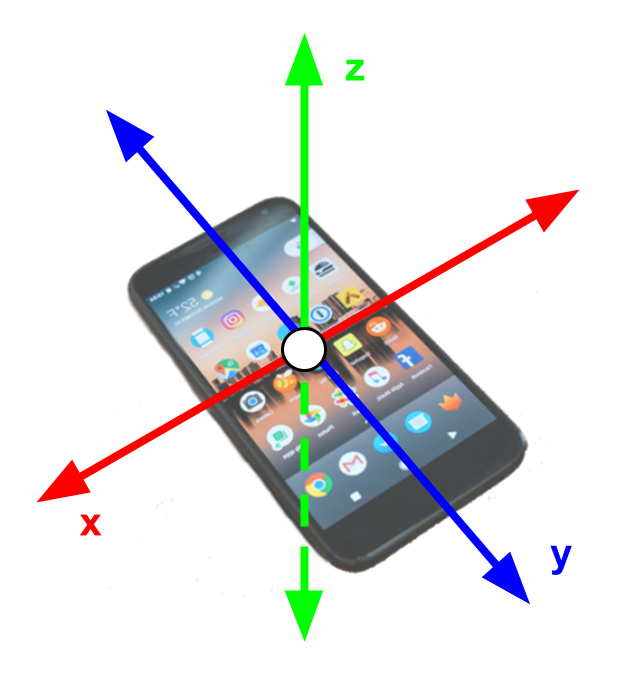

  
Set Up

  
Figure 2: Experimental Set Up

  
  
To collect data, we simply placed our sensor (the phone) on the chest of the person whose data is being collected. We found that the chest was the optimal placement compared to other places on the body, since it was where our sensor could register heartbeat and breathing.

  
Sample Rate

Given the fact that heartbeat is about 0.66 - 1.33 Hz and breath rate is about 0.16 - 0.25 Hz, we wanted a sample rate greater than those ranges to make sure it could pick up both patterns. We started off with data sampled at 10 Hz and then transitioned to 50 Hz after discovering (through trial and error) that data sampled at 50 Hz gave us more data points to analyze.

___

##  Motion Model
To observe and measure meditation with an accelerometer, we must have a base understanding of the various motions occurring. In our experiment we are interested in two motions: breathing and heartbeats. 

  
Heartbeat Motion

Heartbeats are easily measured by one’s own fingers. We can sense the “pulse” of increased blood flow in our veins. The accelerometer seeks to do something extremely similar. If the accelerometer was positioned normal to the heartbeat (so that the movement due to heartbeat was in 1 axis) we would expect the phone to accelerate up and down due to the change of blood flow.

One cycle, or one heartbeat, should correspond to one period of our acceleration normal to the heartbeat. From our research we know that the heart rate of individuals in meditation to be between 50-100 bpm[SOURCE NUM]. This means that we can expect to see this 50-100bpm (.8-1.6 Hz) signal present in our acceleration data.

The above analysis is based on the fact that the phone is positioned normal to the observed motion. Our sensor choice does not gurantee this. For this reason, we expect to see accelerations matching these frequencies in all axes.

  
Breathing Motion

Breathing is arguably more complex motion than the heartbeat, one reason is since it can be controlled by the individual. Our experiment seeks to measure the rise and fall of the subject’s chest while breathing. This motion should also be cyclical in nature. 

We can expect an acceleration while inhaling and corresponding acceleration when exhaling. This means that we should large amounts of the frequencies with the breathing rate (.1-.5 Hz)[SOURCE] Once again this motion should be primarily recorded in one axis. However, the phone will not be placed perfectly on the body so we can expect to see corresponding signals/frequencies in all axes.

The motion of breathing causes the phone to move much more than a heartbeat. This will cause the sensor to potentially move throughout measurement collection. This could introduce error into our data. 

We expect a raw acceleration plot to look something like this:

Figure 3: Theoretical Acceleration

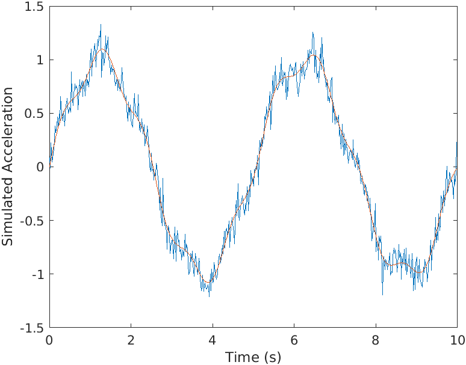

***Generated wave with .95 Hz(heartbeat) and .2 Hz(breathrate) sine waves ***

  
Design decisions based on motion

  
We chose to position the accelerometer directly overtop the heart in hopes of being able to capture the heartbeat (the accelerations from the heartbeat will be of much smaller magnitude than breathing). This placement will allow the monitoring of breath rate at the same time as the heart rate and will minimize other unwanted sensor movements like someone flexing their abs or moving their neck. This position will also have a near zero angular velocity as almost all of the movement is normal to the phone and doesn’t change its rotation around any axes.

___

##  Analytical Method

Before we began actually analyzing the data, some trimming of the data was necessary. In Figure 4, you can see that at the beginning and end of the accelerometer data has some peaks from when the screen is pressed to start data collection. Therefore, we made the decision to trim the very beginning and end of samples to remove these anomalies. 

Figure 4: Raw Acceleration

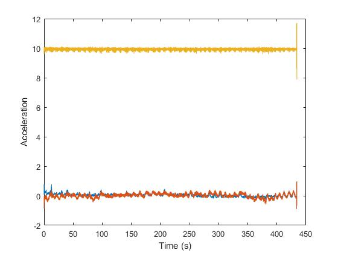 

We then split the data into smaller time chunks in order to examine how metrics like breathing rate and heart rate vary throughout the meditation session.

AFter looking at the FFT of the control data, we decided to filter out the control data. The reasoning for this is that the amplitudes in the frequency range of interest (0.1 - 1.5 Hz) were pretty significant as shown in Figure 5. Our method of filtering involves subtracting the FFT of the control data from the FFT of the actual data. 

Figure 5: Control Data FFT

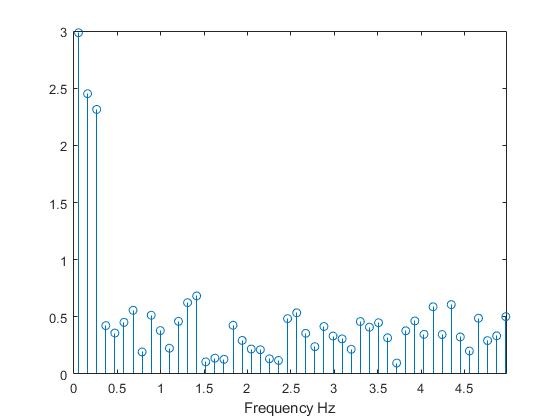 

At this point, we decided to implement a band pass filter to decrease the amplitude of frequencies we are not interested in. To choose the frequency ranges we looked up data on breath rates and heart rates.

*The algorithm(s) for data analysis should demonstrate a clear understanding of Fourier analysis, frequency and time domains, and motion model dynamics. The project website should clearly explain the application of the algorithm to the experimental data through the use of appropriate equations and graphics.*

  
Method Validation

  
To validate our method we performed a first pass analysis on a constructed signal with the frequencies of interest.
Below is a plot of the signal generated in the time domain. This signal has both a .95 Hz and 0.2 Hz signal in the dataset. These two frequencies represent a heart and breath rate respectively. 

 

__Time domain plot of simulated signal w/noise (.2 Hz and .95 Hz signals)__

This signal is then converted into the frequency showing using Matlab’s FFT (Fast Fourier Transform) function ()[INSERT LINK]. This indicates how much of a certain frequency is present in a sample. Below is the figure generated from the FFT function. This signal has been shifted into the frequency domain (Hz).

Figure :
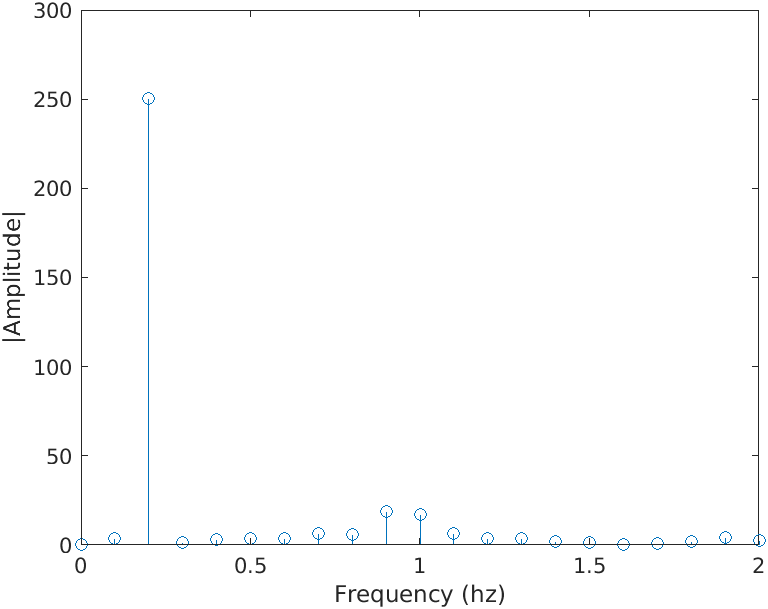 

***Frequency domain plot of simulated signal***

This plot informs us of several things. We do indeed see the presence of the frequencies of interest. Interestingly, there is no maximum amplitude centered around the 0.95 Hz value. Instead it appears that there are sligh spikes at .9 and 1 Hz. This case shows the shortcoming of our process. In the case where a frequency is present in our signal but not aligned with the frequencies used in the fft function the “real” frequency can be masked.

One idea we had was to remedy this problem by using the additional parameter that controls the size of the matrix used to calculate the fft of our signal (https://www.mathworks.com/help/matlab/ref/fft.html#f83-998360-n)[https://www.mathworks.com/help/matlab/ref/fft.html#f83-998360-n]. This parameter could generate more points between a given range in our plot and allow us to look at a more dense range of frequencies.

Figure :
 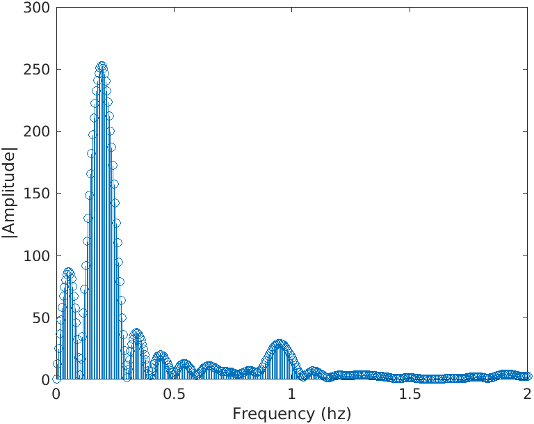 

***Above are two plots showing the same frequency domain plot using fft(x, length(x)) and fft(x, 2*length(x)) respectively***

These graphics show that while this doesn’t create the ideal behavior(other noise in the signal seems to be increased), it does create spikes centered around the expected values at .2 and .95 Hz. Unfortunately, this yields other spikes in non-interesting frequencies. Adjusting the __N__ parameter is worth testing, however, from this data a simple weighted average of the regions of interest would yield the same peak.

Another problem we have identified is the fact that the frequencies will change over time.

In order to understand what our fft would do to an input signal with a varying frequency 

#### Understanding what to expect with varying frequencies

__Data Preparation and Observation__
In order to understand what our fft would do to an input signal with a varying frequency we simulated a signal that had a varying breath rate and constant heart rate (FIGURE 1.ABAN)T 

TIME DOMAIN PLOT OF VARYING FREQUENCY)

__Figure 3.5 Simulated 30 second sample (50 Hz), breath rate changes from .3-.1, heart rate is a constant 1 Hz __

This signal is more representative of what we expect our incoming data to be. We also added noise to the signal shown in blue.

We are interested in the frequencies present in this signal. To examine this we take a fft of the entire 30 second chunk. This yields us *Figure 3.1FSDKFLJ* which shows a clear spike at 1 Hz for the heartbeat and an increased amplitude in the range [0.1 - 0.3] Hz.

 

The results shown in  *Figure 3.slkjfsdlkfj* highlight exactly what we were trying to avoid -- unclear measurements of the frequencies present in the signal. Our plan to avoid this behavior is to sample smaller time chunks of an entire sample. For example we would look at 30 second chunks of a 5 minute sample. In this simulated

#### Investigating Potential Solutions
__*Sub-Sampling*__
Breaking a signal into smaller samples is a valid way to remove the presence of a changing frequency -- because there is less frequency change in a truncated sample [assuming constant variation of frequency]. Unfortunately, having smaller samples also comes at a price -- here is less data, and that will make it harder to pick up the frequencies present in the signal(due to the functionality of the FFT function).

We experimented with breaking this signal into smaller sub samples. These samples were then transformed into the frequency domain. These samples for 3, 6 and 12 second samples are shown in   _FIGURE 1_ , _FIGURE2_ and _FIGURE3_ respectively.

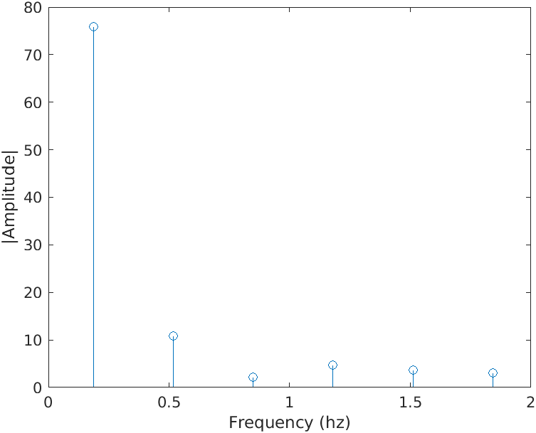 

*Figure 45345 FFT of 3 second sub-sample with varying breathrate [0.3-0.1] Hz and constant 1 Hz heart rate*

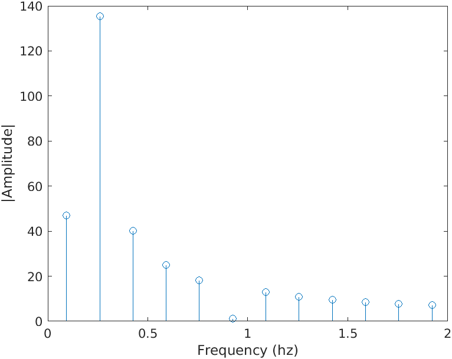 

*Figure 45345 FFT of 6 second sub-sample with varying breathrate [0.3-0.1] Hz and constant 1 Hz heart rate*

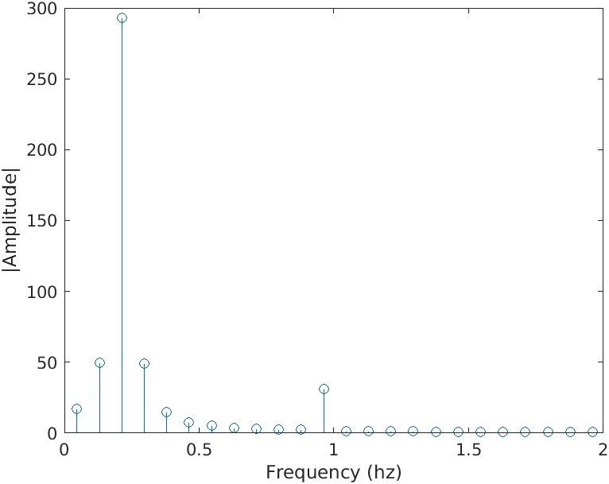 

*Figure 45345 FFT of 12 second sub-sample with varying breathrate [0.3-0.1] Hz and constant 1 Hz heart rate*

__*Increase Frequency Resolution in Transformed signal*__
As we shown in Figure (TOP FIGURE WITH HUGE N VALUE) sometimes using a larger *N* parameter in Matlab’s fft can help us understand the frequency plot of our signal.

We were especially interested if this strategy would help us when the frequency content in a signal is changing. The simulated and chunked data was examined with and without filtering to see if it yielded better results. The filtering was done by band pass filter in which the amplitude of all frequencies that were not a possible heart rate (CITE THIS) or breath rate (CITE THIS) were divided by ten. 

 

 
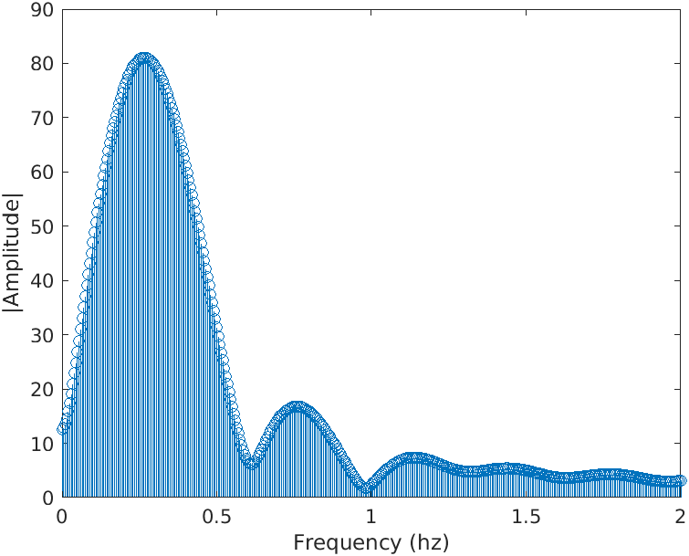 
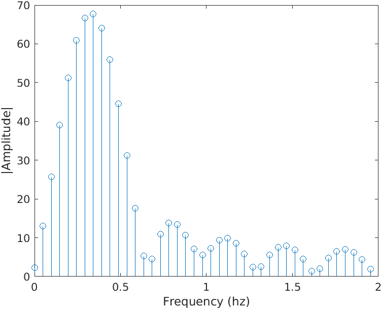 

*Figure12 .1 Frequency Domain plots of 3s sub-sample ploted using (default N, doubled N, doubled N after filtering) *

 

 

 

 

 

 

  

___

## Results
*Show our patterns for heart rate + breath rate.

___

##  Limitations

This project is far from perfect and there are a variety of things that could be done to improve the utility/accuracy of our monitor. These limitations can be broken into several categories

  
Sensor Placement and Choice

  <ul>
    <li>Using an accelerometer as a measurement device requires consistent orientation of the device. For this reason our datasets are likely different between samples.</li>
    <li>Accelerometers are by no means the most effective way to measure heartbeat or breath-rate. (a pulse oximeter and computer vision might yield better results respectively)</li>
    <li>Components of the motion from breathing are present in all 3 axes. This makes computations either more difficult, or more error-prone</li>
    <li>Other frequencies (yawning, swallowing, fidgeting will also be picked up by the accelerometer)</li>
  </ul>

  
Data Processing

  <ul>
    <li>Fourier transforms of time chunks yield presence of certain frequencies (not every frequency). This may makes our breath rate and heart rate detection difficult as we are choosing one frequency with the highest amplitude out of a small number (see figures)</li>
    <li>Raw accelerometer data is unfiltered</li>
    <li>Limited in sampling frequency between 10-100 Hz</li>
  </ul>

  
Nature of the Problem

  <ul>
    <li>People breathe very differently. Breathing through your nose vs mouth or diaphragm yields very different accelerometer plots</li>
    <li>The frequencies we are measuring change over time, we attempt to combat this by looking at small time steps</li>
    <li>Breathing frequencies are quite low and variable which requires us to have large samples</li>
    <li>Breath rate can be controlled more than heart rate, which yields inconsistent signals</li>
    <li>While meditating heart rate generally slows and breath rate should become lower and less “aggressive”. This makes the input signal smaller and more difficult to read</li>
  </ul>

___

##  Next steps
Many of the above limitations/problems are caused by the use of an accelerometer to measure both heartbeat and breath rate. The other limitations tend to fall into the fact that both heart rate and breath rate can vary over time.

  
Different Sensor

Given this, it would be practical to measure both heart-rate and breath rate in another way. Our group recommends using a pulse-oximeter to measure heartbeat and a temperature sensor to measure exhales. Using this array of sensors would remove any use of acceleration data. This would make the signal processing much simpler. Both heart rate and breath rate could be detected in real time and a moving average could be used to estimate the current value.

  
Size of FFT Matrix

  
If the project were to continue using an accelerometer as the primary sensor then the current processes used could be improved. One problem identified is the lack of discrete frequencies calculated in the ranges that were of interest. To obtain a better understanding of this range the size of the FFT matrix calculated by the fft function could be increased. This would yield a denser spread of frequencies within the desired ranges. 

  
Product Creaction

  
In terms of product creation, this software is ready for a beta launch! Refactoring our code into a smartphone app is the final step. This app would be able to parse an entire meditation session into smaller time chunks and then allow the user to look back at portions of their session that were above or below their recommended breathing and heart rates.

___

##  Sources

1. Laskowski, Edward. “Heart Rate: What’s Normal?” Mayo Clinic, 2 Oct. 2020, www.mayoclinic.org/healthy-lifestyle/fitness/expert-answers/heart-rate/faq-20057979.

2. “Mindful Breathing (Greater Good in Action).” Greater Good in Action, ggia.berkeley.edu/practice/mindful_breathing. Accessed 6 Dec. 2020.

3. Soni, Rahul, and Manivannan Muniyandi. “Breath Rate Variability: A Novel Measure to Study the Meditation Effects.” International Journal of Yoga, Medknow Publications & Media Pvt Ltd, Jan. 2019, www.ncbi.nlm.nih.gov/pmc/articles/PMC6329220/.

4. “Vital Signs (Body Temperature, Pulse Rate, Respiration Rate, Blood Pressure).” Johns Hopkins Medicine, www.hopkinsmedicine.org/health/conditions-and-diseases/vital-signs-body-temperature-pulse-rate-respiration-rate-blood-pressure. Accessed 6 Dec. 2020.
