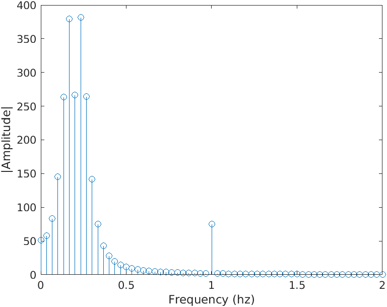
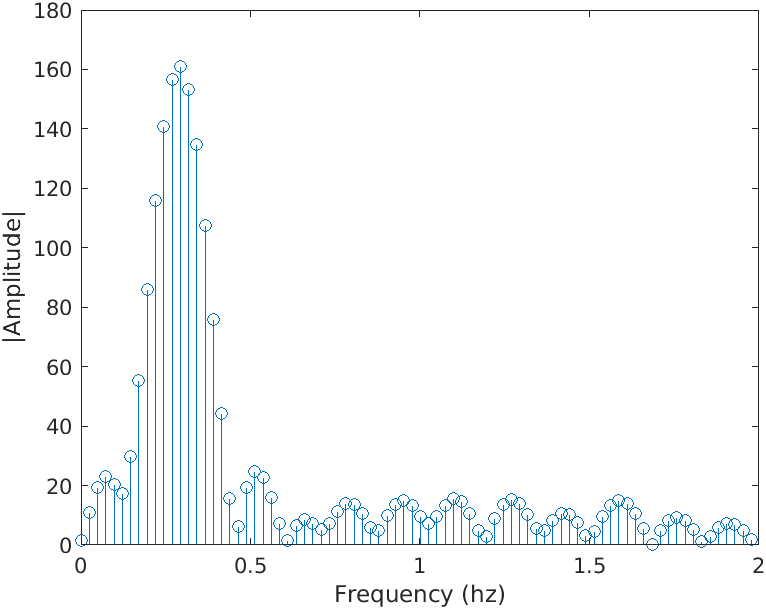
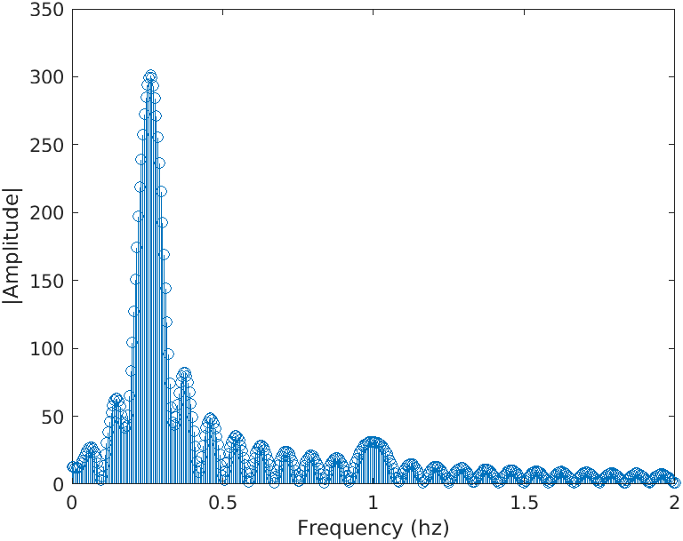
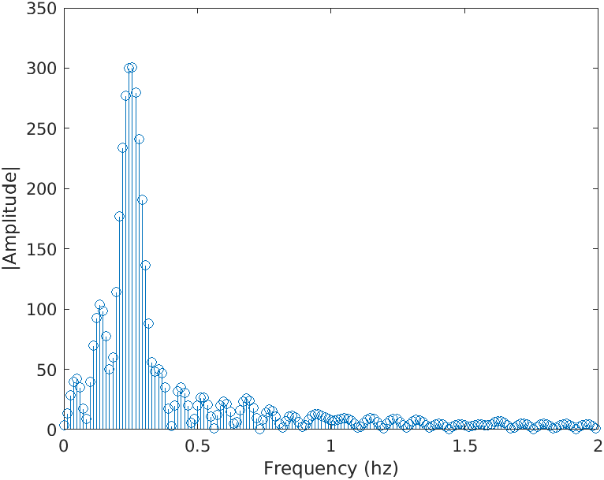

##  Introduction

Our project goal is to be able to detect breathing and heartbeat patterns while a person meditates. The meditation style we're focusing on is shavasana meditation, where someone is lying down and focusing on their breath. 

*We aim to help people new to meditation understand heartbeat and breathing patterns they experience through their meditation sessions*. We plan to use a smartphone accelerometer to obtain motion data while someone meditates. The smartphone will be placed on the person's chest and after we obtain the data we will process it to show breathing and heart rates. The final result will be a plot of the subject's breathing and heartbeat frequencies over time.

  
Background

There are not many existing quantitative measures of meditation that are reliable[3]. Electroencephalogram (EEG), the detection of electrical activity in the brain, and heart rate variability (HRV) are two existing methods, However, they are both responses that take a long time to detect patterns from. Breath rate, however, is a measure that is controlled by meditation and can have changes detected over a short period of time, which is why we decided to focus on it. 

  
Value Creation

We believe that we can help people meditate better! People old and new to meditation will be able to quantitatively monitor and assess their mediation by seeing  a summary of their heartbeat and breathing patterns after the session.

___

##  Data Collection Method

We collected various one minute and five minute samples of someone lying down and meditatin as well as corrresponding control samples of the phone lying in the same orientation and location (but not on a person). 

  
Sensor Choice

We chose to use a Pixel phone's accelerometer as our sensor. This selection was made primarily because we knew the focus of our project was on acceleration data. We also knew that for those new to meditation, a phone is often already present and used as a meditation guide. As such, we decided a phone was the most accessible and reliable sensor for the purposes of this project. 
  
The phone was oriented with the following axes:

<figure>
  
  <figcaption>Figure 1: Sensor Orientation</figcaption>
</figure>

  
Sample Rate

Given the fact that heartbeat is about 0.66 - 1.33 Hz and breath rate is about 0.16 - 0.25 Hz (from our own measurements of pulses and breaths during mediation), we wanted a sample rate greater than those ranges to make sure it could pick up both patterns. We started off with data sampled at 10 Hz and then transitioned to 50 Hz after discovering (through trial and error) that data sampled at 50 Hz gave us more data points to analyze.

  
Set Up

We chose to position the accelerometer directly overtop the heart in hopes of being able to capture the heartbeat (the accelerations from the heartbeat will be of much smaller magnitude than breathing). This placement will allow the monitoring of breath  and hear rate and will minimize other unwanted sensor movements like someone flexing their abs or moving their neck. This position will also record near-zero angular velocities as almost all of the acceleration is normal to the phone.

<figure>
  

    
     
  

  <figcaption>Figure 2: Experimental Set Up</figcaption>
</figure>  

To collect data, we simply placed our sensor (the phone) on the chest of the person whose data is being collected. We found that the chest was the optimal placement compared to other places on the body, since it was where our sensor could register heartbeat and breathing. We recorded more than 5 datasets containing more than 5 minutes of meditation. We also recorded control datasets where the phone was simply sitting in the smae orientation as the other datasets. These datasets will be used to remove error accelerations present in our environment.

___

##  Motion Model
To observe and measure meditation with an accelerometer, we must have a base understanding of the various motions occurring. In our experiment we are interested in two motions: breathing and heartbeats. 

  
Heartbeat Motion

Heartbeats are easily measured by one’s own fingers. We can sense the “pulse” of increased blood flow in our veins. Similarly we expect the accelerometer to register accelerations in all 3 axes due to a heartbeat. This is because a heartbeat cuases the chest to expand in multiple directions hence generating an acceleration in multiple axes. 

One cycle, or one heartbeat, should correspond to one period ofa sinusoidal acceleration in multiple axes. From our research we know that the heart rate of individuals in meditation to be 40-80 BPM (.66-1.33 Hz) we expect to see a signal with matching frequenciest in our acceleration data.

We also expect to see increased components of acceleration in all axes due to the fact that the phone is not oriented perfectly normal to this motion (ie we would expect some component of gravity in all axes and we would also expect a heartbeat to show up in multiple axes)

  
Breathing Motion

Our experiment seeks to measure the rise and fall of the subject’s chest while breathing. Breathing is a more variable motion than the heartbeat because it can be controlled by the individual. This motion should also be cyclical in nature, lending itself to a sinusoidal acceleration -- like the heartbeat.

We expect to see frequencies within the breathing rate (.16-.25 Hz) in our acceleration signal. Once again this motion should be primarily recorded in the Z axis. However, the phone will not be placed perfectly on the body so we can expect to see corresponding signals/frequencies in all axes. We expect the magnitude of acceleration during a breath to be nuch larger than that of a heartbeat as the phone is moving much further in a given amount of time.

We expect a raw acceleration plot to look something like this (Y axis not to scale):

<figure>
  <figcaption>Generated acceleration wave with .95 Hz(heartbeat) and .2 Hz(breathrate) sine waves</figcaption>
  
  <figcaption>Figure 3: Theoretical Acceleration</figcaption>
</figure>

___

##  Signal Processing

After collecting the data, we started off by plotting the raw acceleration to understand what the unprocessed signal looks like. We then trimmed the data to cut noise from the start and end of the data collection period. Then, we explored several methods with the Fast Fourier Transform to examine the frequency content of the signals for all axes. Finally, we decided to break the sample into smaller time samples, filtered out frequencies non-related to meditation and compared the changes in frequencies across the subsamples.

  
Raw Data & Trimming

Before we began analyzing the data, trimming of the data was necessary. Figure 4 shows the raw accelertation data from a single meditation session. The beginning and end of the accelerometer data has peaks from when the screen is pressed to start data collection. Therefore, we made the decision to trim the very beginning and end of samples to remove these anomalies. 

<figure>
   
  <figcaption>Figure 4: Raw Acceleration</figcaption>
</figure>

  
Exploration & Validation of Algorithm

  
#### Examining the Frequency Domain ####
  
We wanted to validate that using the FFT was a correct method for our application. We were specifically interested in identifying frequencies that fall between two discretized points in our frequency domain plot.

<figure>
  
  <figcaption>Figure XXX Frequency domain plot of simulated signal w/noise (.2 Hz and .95 Hz signals)</figcaption>
</figure>

This plot informs us of several things. We do indeed see the presence of the frequencies of interest. Interestingly, there is no maximum amplitude centered around the 0.95 Hz value. Instead it appears that there are peaks at .9 and 1 Hz. This case shows the shortcoming of our process. For instance, if a frequency is present in our signal but not aligned with the frequencies used in the FFT, the true frequency can be masked.

One idea we had to remedy this problem was to use the additional parameter, N, in MATLAB's FFT function (https://www.mathworks.com/help/matlab/ref/fft.html#f83-998360-n)[https://www.mathworks.com/help/matlab/ref/fft.html#f83-998360-n). This parameter should yield a denser frequency domain plot.

<figure>
  

    
     
  

  <figcaption>Figure 12.j Frequency Domain using fft(x, length(x)) and fft(x, 2*length(x)) respectively</figcaption>
</figure>

These figures show that while this doesn’t create the ideal behavior (other noise in the signal seems increased), it does create peaks centered around the expected values at .2 and .95 Hz. Unfortunately, this yields other peaks in non-pertinent frequencies. Adjusting the __N__ parameter is worth testing, though it may obfuscate our data.

#### Examining the Frequency Domain with Varying Frequencies ####

__Data Preparation and Observation__

During meditation, we expect the breathing rate to change over time. As such, we wanted to understand how this changes the results obtained when doing a FFT of a signal with varying frequency content. We simulated a signal that had a varying breath rate (0.3 to 0.1 Hz) and constant heart rate (1 Hz).

<figure>
   
  <figcaption>Figure 3.5 Simulated 30s sample @ 50Hz, breath rate varies from 0.3-0.1 Hz, heart rate is a constant 1 Hz</figcaption>
</figure>

This signal is more representative of what we expect our incoming data to be. We also added noise to the signal shown in blue.

We are interested in the frequencies present in this signal. To examine this we take a fft of the entire 30 second chunk. This yields us *Figure 3.1FSDKFLJ* which shows a clear spike at 1 Hz for the heartbeat and an increased amplitude in the range [0.1 - 0.3] Hz.

<figure>
   
  <figcaption>Figure 12.2 Frequency Domain plot of entire 30s sample</figcaption>
</figure>

The results shown in  *Figure 3.slkjfsdlkfj* highlight exactly what we were trying to avoid -- unclear peaks of the frequencies present in the signal.

#### Investigating Solutions to Unclear 

__Sub-Sampling__

Breaking a signal into smaller samples is a valid way to remove the presence of a changing frequency -- because there is less frequency change in a truncated sample [assuming constant variation of frequency]. Unfortunately, having smaller samples also comes at a price -- there is less data, and that will make it harder to pick up the frequencies present in the signal(due to the functionality of the FFT function).

We experimented with breaking this signal into smaller sub samples. These samples were then transformed into the frequency domain. These samples for 3, 6 and 12 second samples are shown in   _FIGURE 1_ , _FIGURE2_ and _FIGURE3_ respectively.

<figure>
  

     
     
     
  

  <figcaption>Figure 45345 FFT of 3, 6, and 12s sub-sample, respectively, with varying breathrate [0.3-0.1] Hz and 1 Hz heart rate</figcaption>
</figure>

Figure XXXXX shows that longer samples yield more detailed and accurate frequency domain plot. In the longest sample, we can see a clear peak near 1 Hz, whereas the shorter samples do not show this peak. This indicates that while splitting the data will allow us to see different frequencies over time, samples must long enough to result in a useful frequency domain plot.

__Increase Frequency Resolution in Transformed signal__

As we shown in Figure (TOP FIGURE WITH HUGE N VALUE) sometimes using a larger *N* parameter in MATLAB’s FFT can help us understand the frequency domain plot of our signal in certain cases.

We were especially interested if this strategy would help us when the frequency content in a signal is changing. The chunked simulated data was examined with and without filtering to see if it yielded better results. The filtering was done by band pass filter, where the amplitude of all frequencies that were not a potential heart rate or breath rate were divided by ten. 

<figure>
  

     
     
     
  

  <figcaption>Figure 12.j Frequency Domain of 3s sub-sample ploted (default N, doubled N, doubled N after filtering)</figcaption>
</figure>

 

<figure>
  

    
     
     
  

  <figcaption>Figure 12.j Frequency Domain of 6s sub-sample using (default N, doubled N, doubled N after filtering)</figcaption>
</figure>

 

<figure>
  

     
     
     
  

  <figcaption>Figure 12.j Frequency Domain plots of 12s sub-sample using (default N, doubled N, doubled N after filtering)</figcaption>
</figure>

 

The figures show how effective our methods are. The plots **should** all show a large precense of frequencies between 0.3-0.1 Hz and a 1 Hz signal. FIGURE BOTTOM FIGURE shows how longer time samples help distinguish the presence of these frequencies. Surprisingly, using a larger N value (to increase the plot resolution) does not help or yield new information in the frequency domain plot. The same goes for the plot that is made from a filtered signal (the third subplot in Figures HTOSE ABOVE FIGURES).

This changes our plan of analysis to only use the default FFT function and filter out signals outside of our ranges of interest.

___

## Results
*Show our patterns for heart rate + breath rate.

___

##  Limitations

This project is far from perfect and there are a variety of things that could be done to improve the utility/accuracy of our monitor. These limitations can be broken into several categories

  
Sensor Placement and Choice

  <ul>
    <li>Using an accelerometer as a measurement device requires consistent orientation of the device. For this reason our datasets are likely different between samples.</li>
    <li>Accelerometers are by no means the most effective way to measure heartbeat or breath-rate. (a pulse oximeter and computer vision might yield better results respectively)</li>
    <li>Components of the motion from breathing are present in all 3 axes. This makes computations either more difficult, or more error-prone</li>
    <li>Other frequencies (yawning, swallowing, fidgeting will also be picked up by the accelerometer)</li>
  </ul>

  
Data Processing

  <ul>
    <li>Fourier transforms of time chunks yield presence of certain frequencies (not every frequency). This may makes our breath rate and heart rate detection difficult as we are choosing one frequency with the highest amplitude out of a small number (see figures)</li>
    <li>Raw accelerometer data is unfiltered</li>
    <li>Limited in sampling frequency between 10-100 Hz</li>
  </ul>

  
Nature of the Problem

  <ul>
    <li>People breathe very differently. Breathing through your nose vs mouth or diaphragm yields very different accelerometer plots</li>
    <li>The frequencies we are measuring change over time, we attempt to combat this by looking at small time steps</li>
    <li>Breathing frequencies are quite low and variable which requires us to have large samples</li>
    <li>Breath rate can be controlled more than heart rate, which yields inconsistent signals</li>
    <li>While meditating heart rate generally slows and breath rate should become lower and less “aggressive”. This makes the input signal smaller and more difficult to read</li>
  </ul>

___

##  Next steps
Many of the above limitations/problems are caused by the use of an accelerometer to measure both heartbeat and breath rate. The other limitations tend to fall into the fact that both heart rate and breath rate can vary over time.

  
Different Sensor

Given this, it would be practical to measure both heart-rate and breath rate in another way. Our group recommends using a pulse-oximeter to measure heartbeat and a temperature sensor to measure exhales. Using this array of sensors would remove any use of acceleration data. This would make the signal processing much simpler. Both heart rate and breath rate could be detected in real time and a moving average could be used to estimate the current value.

  
Size of FFT Matrix

  
If the project were to continue using an accelerometer as the primary sensor then the current processes used could be improved. One problem identified is the lack of discrete frequencies calculated in the ranges that were of interest. To obtain a better understanding of this range the size of the FFT matrix calculated by the fft function could be increased. This would yield a denser spread of frequencies within the desired ranges. 

  
Product Creaction

  
In terms of product creation, this software is ready for a beta launch! Refactoring our code into a smartphone app is the final step. This app would be able to parse an entire meditation session into smaller time chunks and then allow the user to look back at portions of their session that were above or below their recommended breathing and heart rates.

___

##  Sources

1. Laskowski, Edward. “Heart Rate: What’s Normal?” Mayo Clinic, 2 Oct. 2020, www.mayoclinic.org/healthy-lifestyle/fitness/expert-answers/heart-rate/faq-20057979.

2. “Mindful Breathing (Greater Good in Action).” Greater Good in Action, ggia.berkeley.edu/practice/mindful_breathing. Accessed 6 Dec. 2020.

3. Soni, Rahul, and Manivannan Muniyandi. “Breath Rate Variability: A Novel Measure to Study the Meditation Effects.” International Journal of Yoga, Medknow Publications & Media Pvt Ltd, Jan. 2019, www.ncbi.nlm.nih.gov/pmc/articles/PMC6329220/.

4. “Vital Signs (Body Temperature, Pulse Rate, Respiration Rate, Blood Pressure).” Johns Hopkins Medicine, www.hopkinsmedicine.org/health/conditions-and-diseases/vital-signs-body-temperature-pulse-rate-respiration-rate-blood-pressure. Accessed 6 Dec. 2020.
